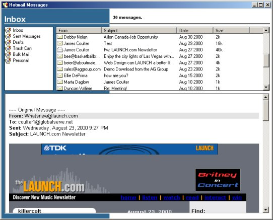



## HotmailBox \(Hotmail Client\)  \*\* Updated October 6\*\*

### Description

UPDATED Sept. 10
This is a much improved version of the Hotmail Checker. It has support for multiple inbox pages, downloads and saves messages for later retrieval, stores your message headers, sends messages and deletes messages. It now includes an Address Book and support for multiple Hotmail accounts.
Bug with the timeout timer was fixed. ** OCT 6 ** Problems with registry under Win95 OSR2 and Win2k should be resolved. ** OCT 6 ** The program was apparently broken and is now functional again ** NOV 9 ** The program should show something when it starts up now
 
### More Info
 

             |
---                |---
**Submitted On**   |2000-11-09 11:22:22
**By**             |[James Coulter](https://github.com/Planet-Source-Code/PSCIndex/blob/master/ByAuthor/james-coulter.md)
**Level**          |Advanced
**User Rating**    |4.8 (77 globes from 16 users)
**Compatibility**  |VB 5\.0, VB 6\.0
**Category**       |[Internet/ HTML](https://github.com/Planet-Source-Code/PSCIndex/blob/master/ByCategory/internet-html__1-34.md)
**World**          |[Visual Basic](https://github.com/Planet-Source-Code/PSCIndex/blob/master/ByWorld/visual-basic.md)
**Archive File**   |[CODE\_UPLOAD115101192000\.zip](https://github.com/Planet-Source-Code/james-coulter-hotmailbox-hotmail-client-updated-october-6__1-11310/archive/master.zip)

